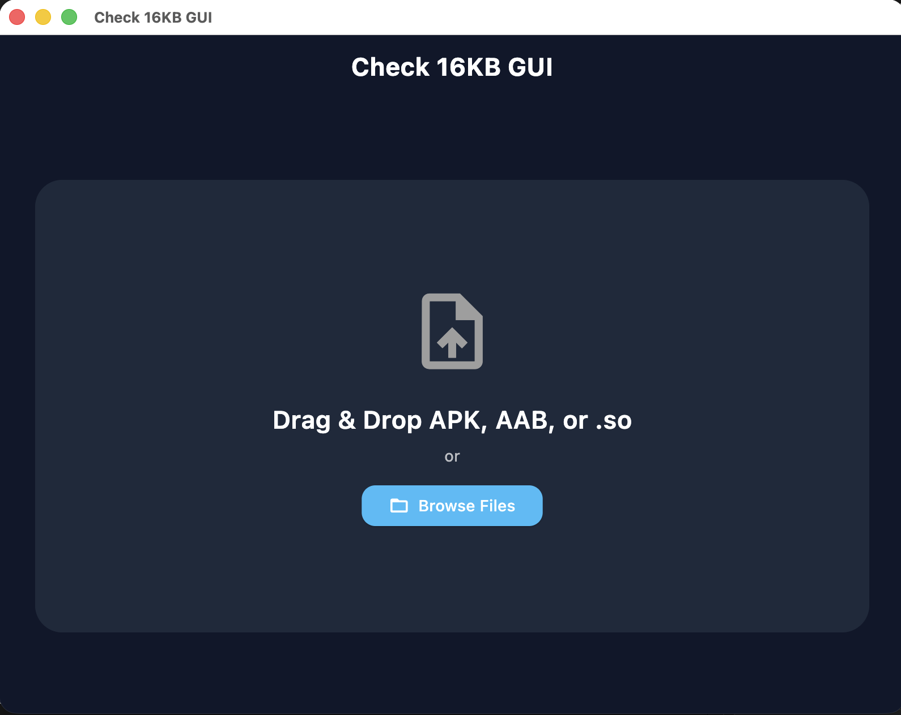
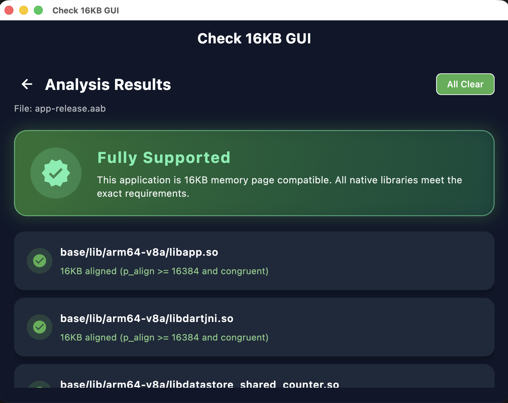

# Check 16KB GUI

A beautiful, fully-featured, cross-platform Desktop Application built with Flutter for checking Android 16KB Page Size Compatibility.

## Screenshots

<!-- markdownlint-disable MD033 -->
<br><br>

<!-- markdownlint-restore -->

## Overview

Starting with Android 15, devices may optionally support 16KB memory page sizes. Apps containing native code (`.so` libraries) that are strictly generated for 4KB boundaries will crash on these devices.

**Check 16KB GUI** allows you to easily verify your APKs, AABs, AARs, or individual `.so` files using a simple, modern drag-and-drop interface.

It implements a purely static **Dart ELF parser**, meaning it analyzes all the `PT_LOAD` segments and ensures:

1. They are properly aligned to 16KB (`p_align >= 16384`).
2. Their file offsets match memory addressing congruencies safely.

**No Android NDK needed!** The application parses everything natively on macOS, Linux, or Windows automatically.

## Features

- **Clean Architecture:** Ensures maximum modularity (Domain, Data, Presentation layers).
- **Premium User Interface:** Uses smooth gradient hero cards and interactive drop-zones (via `desktop_drop`).
- **Archive Decoding Support:** Native unpacking of `.apk`, `.aab`, `.aar`, and `.zip` files seamlessly to find embedded libraries safely using the `archive` package.
- **Provider State Management:** Highly clean and reactive UI logic decoupled from models.
- **Fast Analysis:** Instant scanning of binary files without dependencies on `llvm-readobj` nor shell integration.

## Installation / Building

Make sure you have Flutter installed on your desktop.

```bash
cd check_16kb_gui

# To run the app on macOS
flutter run -d macos

# To run on Windows
flutter run -d windows

# To build release binaries
flutter build macos
flutter build windows
flutter build linux
```

## How to Use

1. Launch **Check 16KB GUI**.
2. Drag and drop any Android application package (APK/AAB) onto the prominent upload zone, or click **Browse Files**.
3. View the Results! It will explicitly generate a premium summary stating whether the application is **Fully Supported** or **Not Compatible** directly along with the specific files and causes of their failure.
